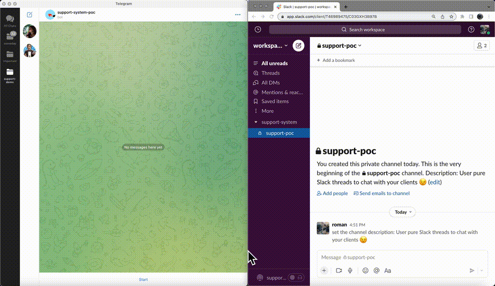

Support system POC built on Cloudflare Workers
=====================================

This is proof-of-concept chatbot-based competitor to Intercom and Zendesk :)

## 📸 Showcase

 
<strong>Demo: users contact support via Telegram bot</strong>

## Details

### Currently supported:

- your clients chat with Telegram bot
- chats of each client are managed by your support team in Slack threads
- welcome messages
- `!close` command to close the thread, new messages from user will go to new thread

### TODO:

- integrations: Viber, Whatsapp, Discord, FB messenger, email, site contact form :)
- (maybe) move support system chats management from Slack to Discord (why not? it has threads too) or even custom portal (???)
- support emojis, image attachments, etc.
- internal messages visible for Slack team but invisible for bot user
- some AI integration and automations and anything else support systems may have

### Deploy:

- install node.js and wrangler (NOTE: tested with Wrangler v1)
- create Slack app with enough rights to post messages at https://api.slack.com/apps?new_app=1 
  - channels:read
  - channels:history
  - chat:write
  - chat:write.customize
  - groups:read
  - groups:write
  - groups:history
- create new Telegram app with https://t.me/BotFather
- use `wrangler.toml.example` to setup `wrangler.toml` 
- call `wrangler publish` to deploy worker to Cloudflare
- use `curl "https://YOUR_DOMAIN/telegram-bot?INSTALLBOT" --data "{}"` to make Telegram send JSON notifications to your worker
- create private channel in Slack and add your bot there as integration
- go to https://api.slack.com/apps/YOUR_APP_ID/event-subscriptions to configure subscriptions to URL `https://YOUR_DOMAIN/slack-bot` and subscribe to events:
  - message.channels
  - message.groups
- ... DONE! :)

### Testing: 

- open chat with your Telegram bot and press "Start" button
- new slack thread should appear in your channel, you can chat with your telegram user from there
- in case of any issues see logs with `wrangler tail -f pretty`

## Author

Roman Shmelev rshmelev@gmail.com

## License

MIT